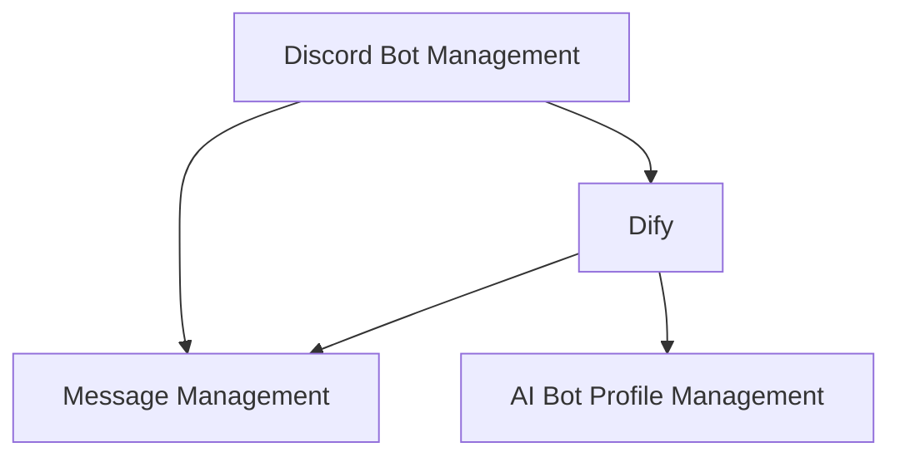
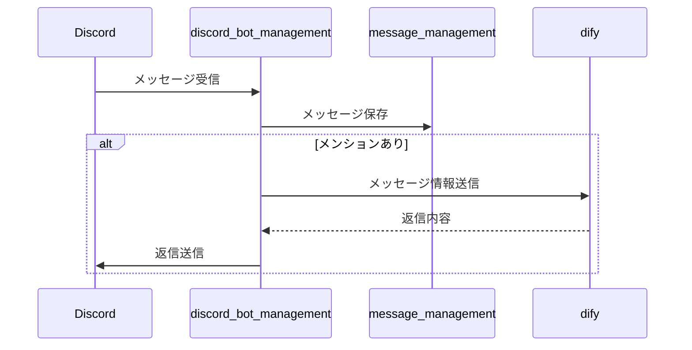
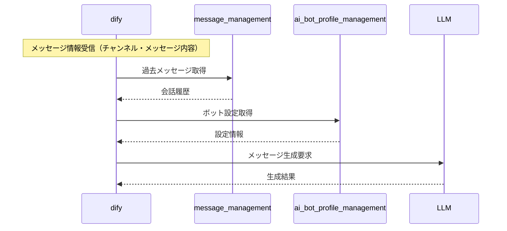
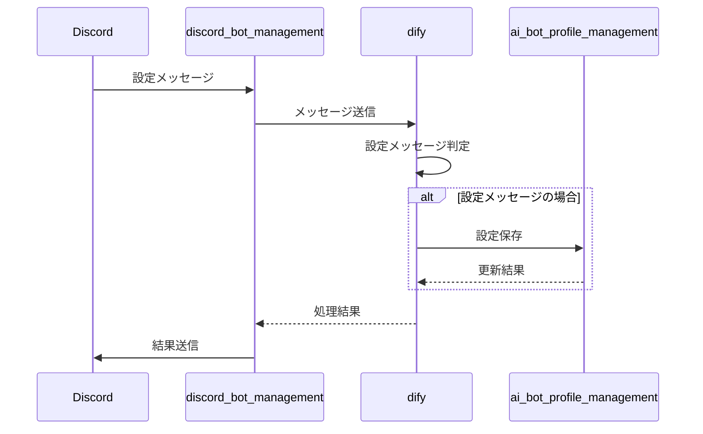

# Discord AI Bot Platform 🤖

Discord向けAIボットプラットフォーム - マイクロサービスベースのスケーラブルなボット管理システム

## System Architecture 📊

### 全体構成

### 処理フロー詳細

#### 1. 返信フロー

#### 2. 返信内容生成フロー

#### 3. 性格設定フロー

### Core Services

| Service | Description | Status |
|---------|-------------|---------|
| [discord_bot_management](https://github.com/FungiFur-Strikers/discord-bot-service) | Discord統合とメッセージルーティング |  |
| [ai_bot_profile_management](https://github.com/FungiFur-Strikers/bot-profile-manager) | ボットのパーソナリティと設定管理 |  |
| [message_management](https://github.com/FungiFur-Strikers/discord-message-service) | 会話履歴とメッセージストレージ |  |

---
