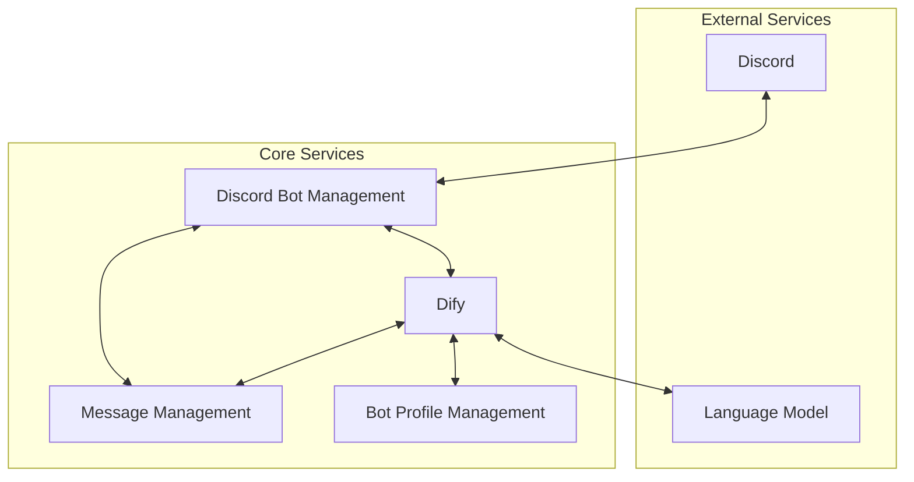
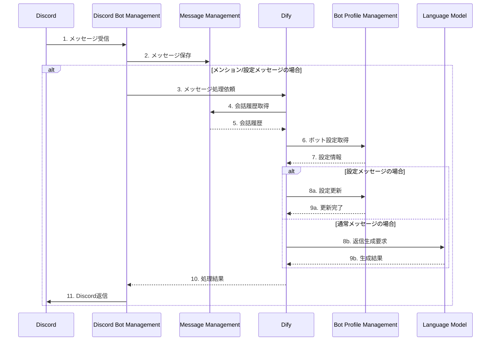

# Discord AI Bot Platform 🤖

Discord向けAIボットプラットフォーム - マイクロサービスベースのスケーラブルなボット管理システム

## システム概要

Discord AI Bot Platformは、AIを活用したボットをDiscord上で効率的に運用・管理するためのプラットフォームです。マイクロサービスアーキテクチャを採用し、柔軟なスケーリングと機能拡張を可能にしています。

## システムアーキテクチャ 📊

### コアサービス構成

### 統合処理フロー

### Core Services

| Service | Description | Status |
|---------|-------------|---------|
| [discord_bot_management](https://github.com/FungiFur-Strikers/discord-bot-service) | Discord統合とメッセージルーティング |  |
| [ai_bot_profile_management](https://github.com/FungiFur-Strikers/bot-profile-manager) | ボットのパーソナリティと設定管理 |  |
| [message_management](https://github.com/FungiFur-Strikers/discord-message-service) | 会話履歴とメッセージストレージ |  |

---
